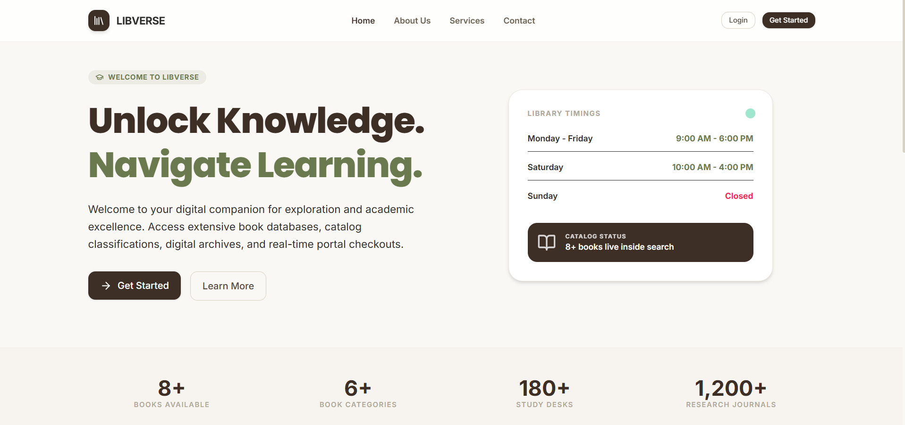

# LibVerse — Modern Library Management System

LibVerse is a state-of-the-art, full-stack Library Management System engineered with **Django REST Framework** and **React (Vite)**. Designed with modern UI/UX aesthetics, robust concurrency controls, role-based authorization, and seamless cross-subdomain authentication.

---

## ✨ Key Features

### 📚 Book Catalog & Inventory Management
* **Database-Driven Stock Synchronization**: Automatic real-time recalculation of available quantities upon stock adjustments or borrowing transactions.
* **Cloud Storage Integration**: Supports **Cloudinary** for storing cover images with local filesystem fallback.
* **Advanced Pagination & Search**: Server-side paginated endpoints for catalog lists, transaction histories, and status filters (`issued`, `returned`, `overdue`).

### 🎓 Student & Borrowing System
* **Pre-Registered Account Linking**: Self-registration automatically links new accounts to pre-authorized student profiles registered by librarians.
* **Borrow Limits & Concurrency Controls**:
  * Strict limit of maximum **5 concurrently issued books** per student.
  * Duplicate checkout prevention for identical book IDs.
* **Transaction Status Tracking**: Automated status checks and fine tracking mechanisms.

### 🔐 Security & Subdomain Authentication
* **HttpOnly JWT Authentication**: Uses Simple JWT with short-lived (15 min) access tokens and rotating refresh tokens stored safely in `HttpOnly` cookies.
* **Cross-Subdomain Cookie Sharing**: Configurable `JWT_COOKIE_DOMAIN` for seamless session management across split subdomains (`libverse.acharyaworks.in` and `api.libverse.acharyaworks.in`).
* **Route Protection**: Guest and Role-based guards protecting administrative routes and guest authentication views.

### 🎨 Design & Accessibility
* **Theme Switching**: Built-in Dark and Light mode options with persistent state in `localStorage`.
* **Responsive Layouts**: Modern split-card layouts for authentication, mobile drawer menus, and GFM alerts.
* **Dynamic SEO**: Integrated SPA `<SEO>` manager, Open Graph sharing cards, `sitemap.xml`, and `robots.txt`.

---

## 🛠️ Tech Stack

### Frontend
* **Core**: React 18, Vite, React Router v6
* **Styling**: Tailwind CSS v4, Lucide Icons
* **Testing**: Vitest, React Testing Library, jsdom
* **API Client**: Axios (configured with credentials and response interceptors)

### Backend
* **Framework**: Python 3.12+, Django 5+, Django REST Framework
* **Database**: PostgreSQL (Neon DB) / SQLite (Fallback)
* **Authentication**: djangorestframework-simplejwt (Custom HttpOnly Cookie Auth)
* **Cloud Media**: `django-storages` & `cloudinary`
* **Static Assets**: WhiteNoise

---

## 🌐 Deployment Architecture

* **Frontend**: Deployed on **Vercel** (`https://libverse.acharyaworks.in`)
* **Backend API**: Deployed on **Render** (`https://api.libverse.acharyaworks.in`)
* **Database**: Hosted on **Neon PostgreSQL**

---

## 📡 Key API Endpoints

| Category | Endpoint | Method | Access | Description |
| :--- | :--- | :--- | :--- | :--- |
| **Auth** | `/api/auth/register/` | `POST` | Public | Register student account |
| **Auth** | `/api/auth/login/` | `POST` | Public | Obtains JWT tokens into HttpOnly cookies |
| **Auth** | `/api/auth/logout/` | `POST` | Authenticated | Clears HttpOnly JWT cookies |
| **Auth** | `/api/auth/user/` | `GET` | Authenticated | Fetches authenticated user profile |
| **Books** | `/api/books/` | `GET` / `POST` | Authenticated | List catalog / Create book (Admin) |
| **Students**| `/api/students/` | `GET` / `POST` | Admin Only | Manage student directory listings |
| **Transactions** | `/api/transactions/` | `GET` / `POST` | Authenticated | List transactions / Issue book |
| **Transactions** | `/api/transactions/issued/` | `GET` | Authenticated | List active issued checkouts |
| **Transactions** | `/api/transactions/returned/` | `GET` | Authenticated | List returned book records |
| **Transactions** | `/api/transactions/overdue/` | `GET` | Authenticated | List overdue transactions |

---

## 📄 License

This project is licensed under the MIT License.
